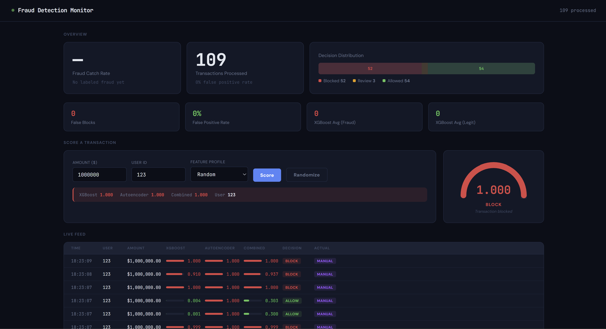
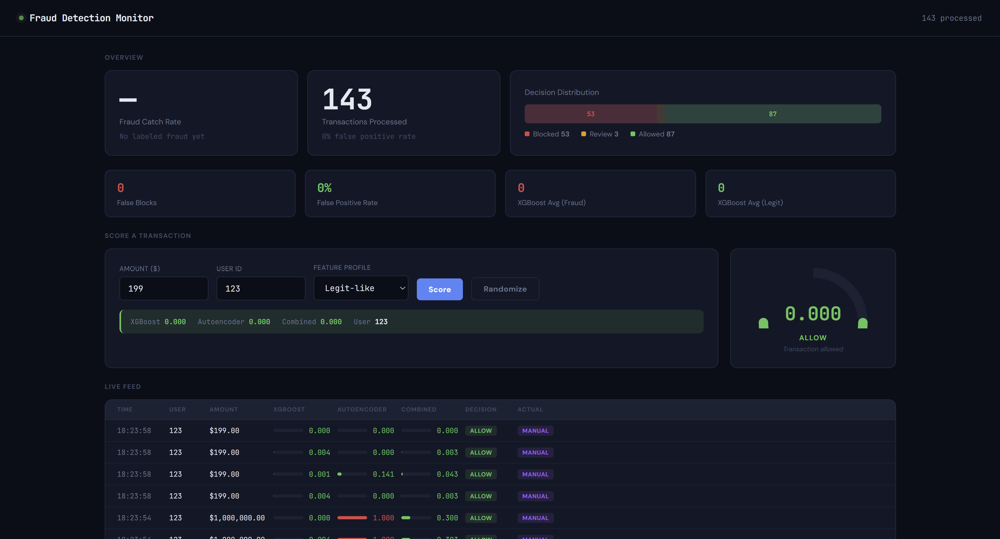
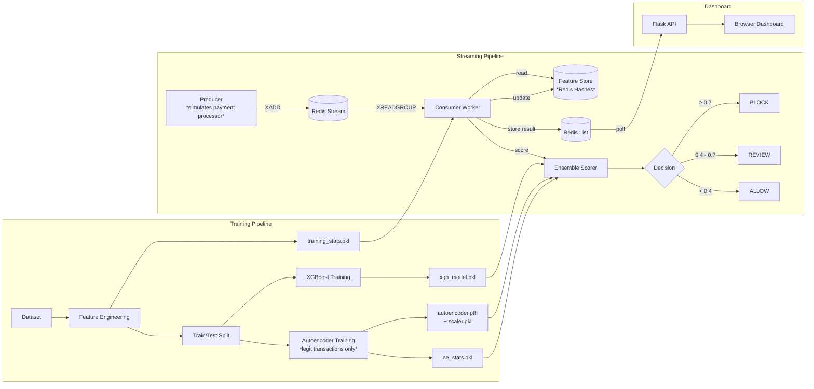

# Real-Time Fraud Detection System

# EXAMPLE




A real-time credit card fraud detection pipeline that scores transactions as they arrive using an ensemble of a gradient-boosted tree model and a neural network autoencoder, served over Redis Streams with a live monitoring dashboard.

The system processes transactions in milliseconds, combining a supervised model that recognizes known fraud patterns with an unsupervised anomaly detector that catches novel attacks the supervised model has never seen.

## Architecture



## Results

| Metric | XGBoost | Autoencoder | Ensemble |
|--------|---------|-------------|----------|
| AUC-ROC | 0.9999 | 0.9468 | 0.9999 |
| Precision | 99.63% | 94.20%* | 99.79% |
| Recall | 99.76% | 81.13%* | 99.49% |

*\*Autoencoder uses a 95th-percentile threshold; it's designed as a safety net for novel fraud, not as the primary detector.*

**Streaming pipeline**: 100% fraud catch rate, 0 false positives across 50 test transactions with tiered BLOCK/REVIEW/ALLOW decisions.

## How It Works

**1. Feature Engineering** — Raw transaction features (V1-V28, Amount) are enriched with log-transformed amounts, z-scores, interaction features between top-ranked PCA components, Euclidean magnitude across all features, and extreme value counts. Training statistics are saved so the streaming pipeline applies identical transformations.

**2. XGBoost (Supervised Model)** — A gradient-boosted tree classifier trained on labeled fraud/legit transactions. Builds 100 sequential decision trees where each tree corrects the mistakes of the previous ones. Outputs a fraud probability between 0 and 1.

**3. Autoencoder (Anomaly Detector)** — A neural network (34→16→8→16→34) trained only on legitimate transactions. It learns to compress and reconstruct what "normal" looks like. Fraud transactions produce high reconstruction error because the network can't reconstruct patterns it never learned. This catches novel fraud types that XGBoost might miss.

**4. Ensemble Scoring** — Both model scores are normalized to 0-1 and combined with a 70/30 weighted average favoring XGBoost. The combined score feeds into a tiered decision system: ≥0.7 blocks the transaction, 0.4-0.7 triggers a review, <0.4 allows it through.

**5. Streaming Pipeline** — Transactions flow into a Redis Stream via a producer. A consumer worker pulls transactions, looks up per-user behavioral aggregates from a Redis-backed feature store (average spend, last transaction time, spending patterns), computes features, scores with both models, makes a decision, updates the user's aggregates, and stores the result.

**6. Feature Store** — Redis hashes store per-user aggregates that get updated after every transaction. This enables user-relative features like "this purchase is 15x their average" without scanning full transaction history on every request.

## Tech Stack

| Component | Technology | Rationale |
|-----------|-----------|-----------|
| Supervised Model | XGBoost | Industry standard for tabular data, fast inference, interpretable feature importance |
| Anomaly Detector | PyTorch (autoencoder) | Catches novel fraud patterns via reconstruction error, complements the supervised model |
| Streaming | Redis Streams | Lightweight message queue with consumer groups, already in the stack for the feature store |
| Feature Store | Redis Hashes | Sub-millisecond reads for per-user aggregates, atomic updates via pipelining |
| Dashboard | Flask + vanilla JS | Minimal overhead, polls Redis for live results |
| Feature Engineering | pandas, NumPy | Standard data science stack, saved training statistics ensure consistency between training and inference |

**Why Redis Streams over Kafka?** Redis Streams provides the ordering, consumer groups, and acknowledgment semantics needed for this workload. Since Redis is already in the stack for the feature store, using Streams avoids the operational overhead of running a separate Kafka cluster. For a system processing thousands of transactions per second (vs millions), Redis handles the throughput while keeping infrastructure simple.

**Why an ensemble over a single model?** A single supervised model can only catch fraud patterns present in its training data. The autoencoder acts as a safety net — it doesn't need to have seen a specific fraud pattern before, it just needs to recognize that a transaction doesn't look "normal." The tradeoff is slightly higher system complexity for meaningfully better coverage against novel attack types.

## Project Structure

```
fraud-detection/
├── data/                       # Dataset (gitignored)
│   └── creditcard.csv
├── models/                     # Trained models + stats (gitignored)
│   ├── xgb_model.pkl           # XGBoost classifier
│   ├── autoencoder.pth         # Autoencoder weights
│   ├── scaler.pkl              # StandardScaler for autoencoder input
│   ├── training_stats.pkl      # Feature engineering statistics
│   └── ae_stats.pkl            # Autoencoder error distribution stats
├── src/
│   ├── data.py                 # Data loading + feature engineering
│   ├── train.py                # XGBoost training + evaluation
│   ├── autoencoder.py          # Autoencoder training + anomaly scoring
│   ├── ensemble.py             # Combines both models, threshold analysis
│   ├── feature_store.py        # Per-user aggregates in Redis
│   ├── producer.py             # Simulates transactions into Redis Stream
│   ├── consumer.py             # Real-time scoring worker
│   ├── dashboard.py            # Flask dashboard + scoring API
│   ├── templates/
│   │   └── dashboard.html      # Dashboard frontend
│   └── generate_data.py        # Synthetic data generator
├── Dockerfile
├── docker-compose.yml
├── docker-entrypoint.sh
├── requirements.txt
├── .gitignore
├── .dockerignore
└── README.md
```

## Quick Start (Docker)

```bash
git clone https://github.com/YOUR_USERNAME/fraud-detection.git
cd fraud-detection
docker compose up --build
```

This starts Redis, generates synthetic data, trains both models, and launches the dashboard. Open `http://localhost:5000` to submit transactions and see scores in real-time.

## Manual Setup

```bash
git clone https://github.com/YOUR_USERNAME/fraud-detection.git
cd fraud-detection
python3 -m venv venv
source venv/bin/activate    # Windows: venv\Scripts\activate
pip install -r requirements.txt
```

### Dataset

Download the [Credit Card Fraud Detection Dataset 2023](https://www.kaggle.com/datasets/nelgiriyewithana/credit-card-fraud-detection-dataset-2023) from Kaggle and save the CSV as `data/creditcard.csv`.

Or generate synthetic data for testing:
```bash
python src/generate_data.py
```

### Train Models

```bash
python src/train.py          # Train XGBoost, saves model + training stats
python src/autoencoder.py    # Train autoencoder, saves model + scaler + error stats
python src/ensemble.py       # Evaluate combined performance
```

### Run the Streaming Pipeline

Requires [Redis](https://redis.io/docs/getting-started/) installed and running.

```bash
# Start Redis
redis-server --daemonize yes

# Terminal 1: Produce transactions
python src/producer.py

# Terminal 2: Score in real-time
python src/consumer.py

# Terminal 3: Launch dashboard
python src/dashboard.py
# Open http://localhost:5000
```

## Design Decisions

**Saving training statistics** — Feature engineering computes values like z-scores that depend on the training data's mean and standard deviation. These statistics are saved during training and loaded by the streaming consumer so that new transactions are compared against the same baseline. Without this, the consumer would need to hardcode values or recompute them on different data, leading to inconsistent scoring.

**Per-user aggregates vs per-transaction features** — The dataset's PCA features capture transaction-level patterns, but the strongest fraud signals come from comparing a transaction against a user's behavioral history ("this is 15x their average spend"). The feature store maintains running aggregates per user that update after each transaction, enabling these comparisons without scanning full history.

**Tiered decision thresholds** — Rather than a binary fraud/not-fraud output, the system uses three tiers. This mirrors real production systems where blocking a legitimate transaction has a cost (lost revenue, customer frustration), so medium-confidence cases get a review path (e.g., SMS confirmation) instead of an outright block.

**Autoencoder error normalization** — Raw reconstruction error is normalized against the 95th percentile of legitimate transaction errors observed during training. This converts the unbounded error into a meaningful 0-1 score where values near or above 1.0 indicate high anomaly. The percentile threshold is saved alongside the model so the normalization is reproducible.
